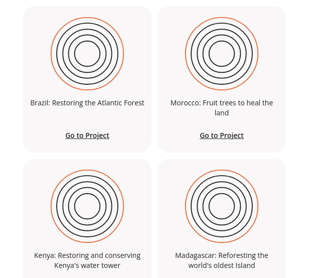
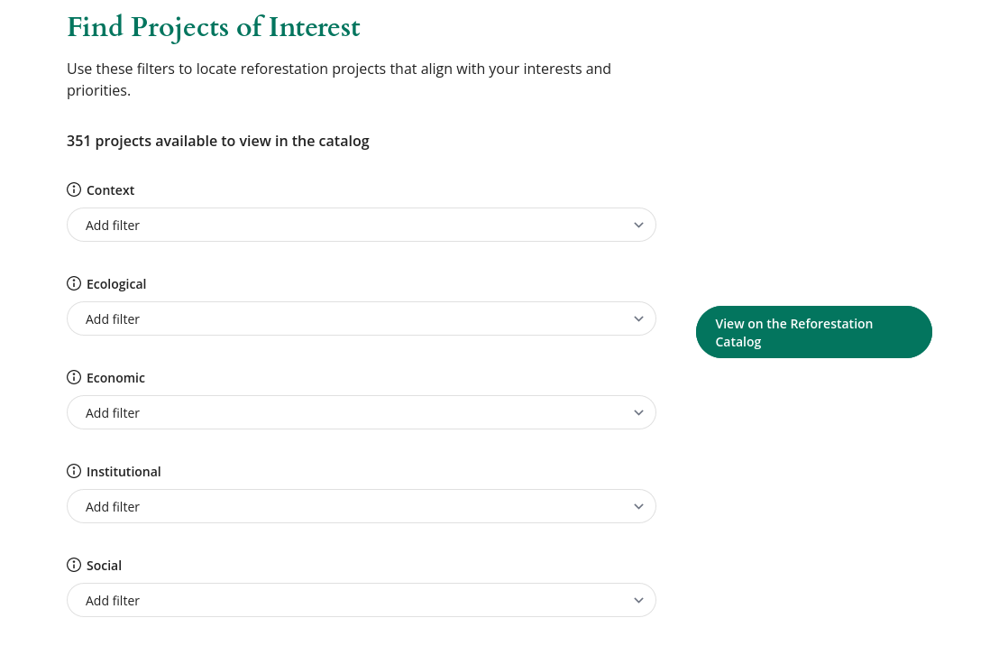

# Embedding

Two parts of the application can be embedded in an iframe:
- The catalogue
- The filters of the catalogue

## Catalogue



Here is how to create an embedded view of the catalogue:

1. Navigate to the catalogue and apply the filters and sorting you wish to see
2. Copy the URL of the page. For example, it may look like: https://reforestation.app/explore?search=%22ecosia%22&sort=%22context%22.
3. In the URL, replace `/explore` by `/embed/catalog`. The new URL will look like: https://reforestation.app/embed/catalog?search=%22ecosia%22&sort=%22context%22.

This new URL is the one you will use in the iframe code:
```html
<iframe title="Reforestation.app catalogue" width="620" height="550" src="https://reforestation.app/embed/catalog?search=%22ecosia%22&sort=%22context%22"></iframe>
```

## Filters of the catalogue



To create the embedded view of the catalogue's filter, you need to create an iframe with the following URL: https://reforestation.app/embed/filters:
```html
<iframe title="Reforestation.app filters" width="1100" height="720" src="https://reforestation.app/embed/filters"></iframe>
```